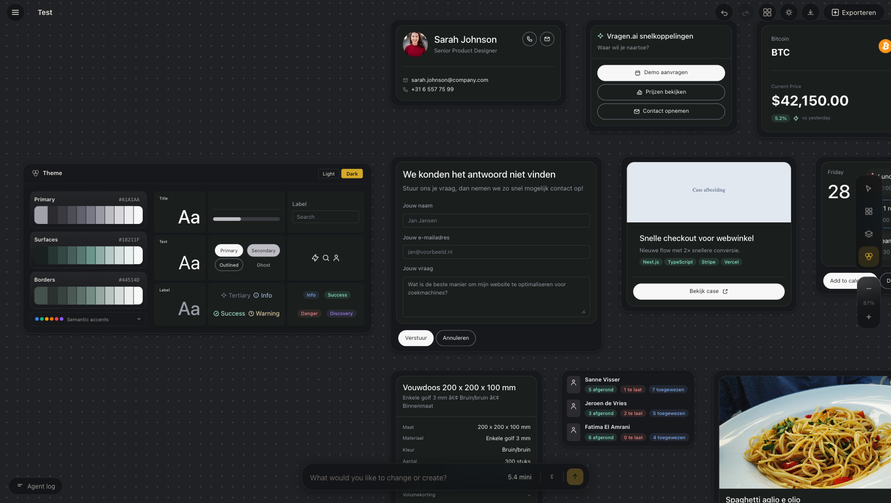

# GenUI Studio

[](LICENSE.md)
[](https://plant.treeware.earth/swisnl/genui-widgets)
[](https://www.swis.nl)

An AI-powered visual UI widget builder and design studio. Create, edit, and manage reusable widget templates with the help of Claude or ChatGPT.



## What it does

GenUI Studio is a web-based IDE for building OpenAI Chatkit compatible widgets. You describe what you want in natural language, and the AI agent generates or modifies widget templates on a visual canvas. Templates use a JSX-like syntax that compiles to Nunjucks JSON templates, compatible with the `@swis/genui-widgets` component library.

Key features:
- **AI agent**: Chat with Claude or ChatGPT to generate and modify widgets
- **Visual canvas**: Drag, position, and arrange widgets on an infinite canvas
- **Live preview**: See widgets render with dynamic template data in real time
- **Theme system**: Full light/dark mode with customizable color palettes
- **Multi-project**: Create and switch between multiple projects
- **Undo/redo**: Full history with keyboard shortcuts

## Requirements

- Node.js
- An [Anthropic API key](https://console.anthropic.com/) and/or [OpenAI API key](https://platform.openai.com/)

## Setup

```bash
npm install
```

Create a `.env` file in the project root:

```env
VITE_ANTHROPIC_API_KEY=your_anthropic_key_here
VITE_OPENAI_API_KEY=your_openai_key_here
```

API keys can also be entered directly in the app's UI.

## Running

```bash
# Development server (hot reload)
npm run dev

# Build for production
npm run build

# Preview production build
npm run preview
```

## Changelog

Please see [CHANGELOG](CHANGELOG.md) for more information on what has changed recently.

## Contributing

Please see [CONTRIBUTING](https://github.com/spatie/.github/blob/main/CONTRIBUTING.md) for details.

## Security Vulnerabilities

Please review [our security policy](../../security/policy) on how to report security vulnerabilities.

## Credits

- [Joris Meijer](https://github.com/jormeijer)
- [All Contributors](../../contributors)

## License

This package is open-sourced software licensed under the [GPL License](LICENSE).

This package is [Treeware](https://treeware.earth). If you use it in production, then we ask that you [**buy the world a tree**](https://plant.treeware.earth/swisnl/mcp-client) to thank us for our work. By contributing to the Treeware forest you’ll be creating employment for local families and restoring wildlife habitats.

## SWIS :heart: Open Source

[SWIS](https://www.swis.nl) is a web agency from Leiden, the Netherlands. We love working with open source software.
